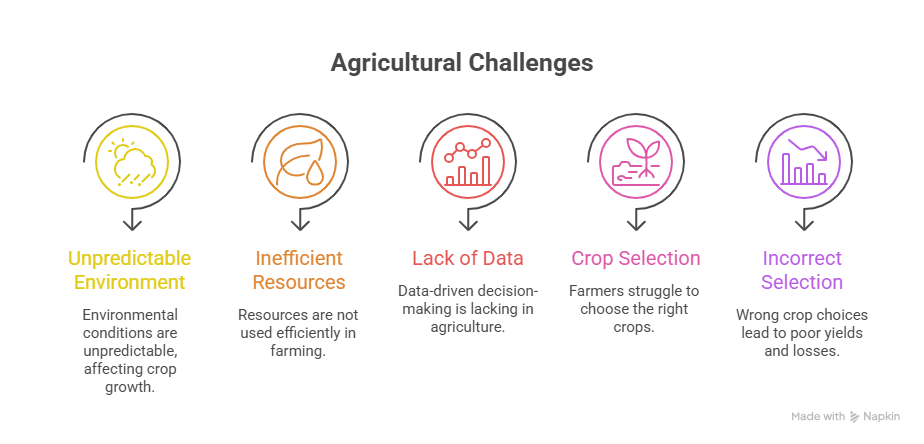
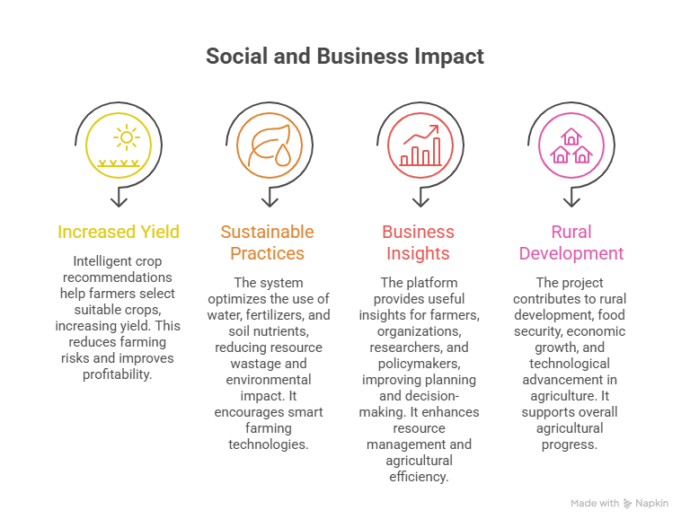

# Business Problem Specification

The agricultural sector faces significant challenges in achieving high productivity and sustainable farming due to unpredictable environmental conditions, inefficient resource utilization, and lack of data-driven decision-making. One of the major problems faced by farmers is selecting the most suitable crop based on available soil nutrients and climatic conditions. Traditional farming decisions are often based on experience or assumptions, which may not always provide accurate results under changing environmental conditions.

Incorrect crop selection can lead to poor yield, excessive use of fertilizers and water, increased production costs, financial losses, and reduced agricultural efficiency. Variations in soil nutrient composition such as Nitrogen (N), Phosphorous (P), and Potassium (K), along with environmental factors including temperature, humidity, pH level, rainfall, and seasonal conditions, directly influence crop growth and productivity. Farmers frequently face difficulties in analyzing these parameters and making informed decisions.

The business problem addressed by this system is the need for an intelligent and reliable agricultural recommendation platform that can analyze environmental and soil-related parameters and provide accurate crop recommendations. The system aims to support farmers, agricultural researchers, agribusiness organizations, and policymakers by delivering predictive insights that improve decision-making.

The proposed solution utilizes machine learning and predictive analytics techniques to identify relationships between agricultural factors and crop suitability. By providing recommendations based on real-time and historical data, the system helps optimize resource usage, increase crop yield, reduce financial risk, and promote sustainable farming practices.

The expected outcomes of the system include:

* Improved crop selection accuracy
* Efficient use of agricultural resources
* Increased farming productivity and profitability
* Reduced environmental impact through optimized resource utilization
* Better support for agricultural planning and decision-making

This business problem specification serves as the basis for further stages including requirement analysis, data collection, model development, system design, implementation, and deployment of the agricultural recommendation system.

# Business Requirements

The system should analyze agricultural and environmental data to generate accurate crop recommendations. It must process important parameters such as Nitrogen (N), Phosphorous (P), Potassium (K), temperature, humidity, rainfall, pH level, and seasonal conditions to determine suitable crops.

The application should provide a user-friendly web interface where users can enter agricultural data and receive real-time crop predictions. It should ensure proper integration between the machine learning model and the web application for reliable and efficient results.

The system should support machine learning algorithms, data preprocessing, and prediction analysis to improve accuracy. It should also optimize the use of resources such as water and fertilizers, reduce crop failure risks, and maintain scalability for future enhancements.

# Literature Survey

Various research studies have explored the application of Machine Learning and Artificial Intelligence in agriculture to improve crop recommendation and farming efficiency.

1. Machine Learning-Based Optimal Crop Selection System in Smart Agriculture
   Authors: Sita Rani et al. (2023)
   Description: This paper focuses on machine learning techniques for crop selection based on environmental and soil parameters. The study showed that ML models can improve decision-making and crop productivity.
   Paper Link: [Scientific Reports Paper](https://www.nature.com/articles/s41598-023-42356-y?utm_source=chatgpt.com)

2. Enhancing Agricultural Productivity: A Machine Learning Approach to Crop Recommendations
   Authors: Farida Siddiqi Prity et al. (2024)
   Description: This research applied machine learning algorithms to improve crop recommendations and agricultural productivity using agricultural datasets.
   Paper Link: [Springer Research Paper](https://link.springer.com/article/10.1007/s44230-024-00081-3?utm_source=chatgpt.com)

3. Crop Recommendation System Using Machine Learning
   Authors: K. Salma Kathoon et al. (2025)
   Description: The study proposed a crop recommendation system using Neural Networks and soil parameters such as Nitrogen, Phosphorous, Potassium, pH, humidity, and rainfall for prediction.
   Paper Link: [Research PDF Paper](https://www.scitepress.org/Papers/2025/138908/138908.pdf?utm_source=chatgpt.com)

4. Incorporating Soil Information with Machine Learning for Crop Recommendation
   Authors: Hadeeqa Afzal et al. (2025)
   Description: This paper analyzed soil properties and environmental factors to improve recommendation accuracy and agricultural output.
   Paper Link: [Scientific Reports Study](https://doi.org/10.1038/s41598-025-88676-z?utm_source=chatgpt.com)

The literature survey shows that machine learning algorithms significantly improve crop prediction, resource optimization, and agricultural decision-making. The findings from these studies help in selecting appropriate techniques for developing the proposed agricultural production optimization system.

# Social and Business Impact

The proposed system provides positive social and business benefits by improving agricultural productivity through intelligent crop recommendations. Farmers can select suitable crops based on soil and environmental conditions, which helps increase yield, reduce farming risks, and improve profitability.

The system supports sustainable farming practices by optimizing the use of water, fertilizers, and soil nutrients, reducing resource wastage and environmental impact. It also encourages the adoption of smart farming and precision agriculture technologies.

From a business perspective, the platform benefits farmers, agricultural organizations, researchers, and policymakers by providing useful insights for better planning and decision-making. It can improve resource management and agricultural efficiency.

Overall, the project contributes to rural development, food security, economic growth, and technological advancement in agriculture.

