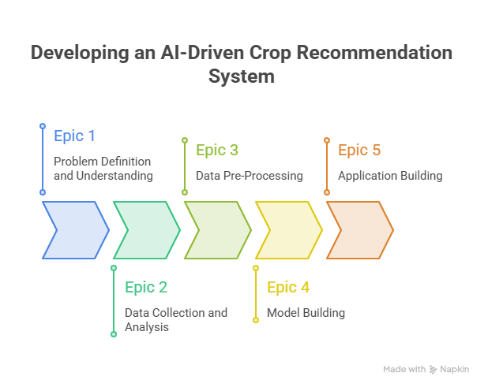

# OptiCrop-Smart-Agriculture-Production-Optimization-Engine

# Entity Relationship (ER) Diagram

The ER diagram represents the core entities involved in the **OptiCrop Smart Agricultural Production Optimization System** and illustrates how these entities interact with one another. It provides a structured approach for organizing user information, soil data, crop recommendations, machine learning models, prediction outcomes, and generated reports within the system database.

## Primary Entities

The ER diagram consists of seven primary entities:

1. User
2. SoilData
3. Crop
4. Dataset
5. MLModel
6. Prediction
7. Report

Each entity is uniquely identified using a primary key as follows:

* **User:** `user_id`
* **SoilData:** `soil_id`
* **Crop:** `crop_id`
* **Dataset:** `dataset_id`
* **MLModel:** `model_id`
* **Prediction:** `prediction_id`
* **Report:** `report_id`

## Relationships

The relationships between entities are defined as follows:

* **User to SoilData:** One user can submit multiple soil data records for crop analysis (**One-to-Many**).

* **SoilData to Prediction:** One soil data record generates a single crop prediction result (**One-to-One**).

* **Crop to Prediction:** One crop can be recommended across multiple prediction results (**One-to-Many**).

* **MLModel to Prediction:** One machine learning model can generate multiple prediction records (**One-to-Many**).

* **Dataset to MLModel:** One dataset can be used to train multiple machine learning models (**One-to-Many**).

* **Prediction to Report:** One prediction can generate multiple agricultural reports and recommendations (**One-to-Many**).

## Foreign Keys

The entities are linked through the following foreign keys:

* `SoilData` references `User` through `user_id`.
* `Prediction` references `SoilData` through `soil_id`.
* `Prediction` references `Crop` through `crop_id`.
* `Prediction` references `MLModel` through `model_id`.
* `Report` references `Prediction` through `prediction_id`.

## Cardinality

The cardinality of the relationships defines how entities interact within the system. A single user can submit multiple soil data records for agricultural analysis. Each soil data entry is processed by a machine learning model to generate crop prediction results. A crop may appear in multiple prediction outcomes, while one machine learning model can generate predictions for numerous users under different soil conditions. Additionally, each prediction may generate multiple reports containing farming summaries and recommendations.

## Normalization and Database Structure

The ER diagram follows normalization principles by separating user information, soil parameters, crop details, datasets, machine learning models, prediction records, and reports into independent entities. This design minimizes redundancy, improves scalability, enhances data integrity, and ensures efficient management of agricultural and prediction-related information.

## Use Case Coverage

The ER model supports the major functionalities of the **OptiCrop Smart Agricultural Production Optimization System**, including:

* Collecting and managing soil and environmental data from users.
* Predicting suitable crops using machine learning algorithms.
* Managing datasets and trained machine learning models.
* Generating intelligent crop recommendations and prediction reports.
* Supporting sustainable farming practices and data-driven agricultural decision-making.

# Pre-requisites

The project was developed using a set of powerful python-based tools and libraries for data processing, machine learning, visualization, and deployment. These technologies provide the foundation for efficient model development, analysis, and application deployment.

* Anaconda Navigator
* Pycharm
* Numpy
* Pandas
* Scikit-learn
* Matplotlib
* Seaborn
* Flask

# Project Epics

## Epic 1: Problem Definition and Understanding

This phase focuses on identifying the agricultural problem, understanding business requirements, and studying existing approaches to build a strong foundation for the crop recommendation system.

### User Stories

**Story 1:** Identify and define the agricultural problem that the crop recommendation system is intended to solve.

**Story 2:** Gather and analyze business requirements to understand project objectives and expected outcomes.

**Story 3:** Conduct a literature survey to study existing crop recommendation techniques and machine learning approaches.

**Story 4:** Analyze the social and business impact of implementing an AI-driven crop recommendation solution.

---

## Epic 2: Data Collection and Analysis

This phase focuses on acquiring agricultural data and performing exploratory analysis to understand data characteristics and identify useful patterns.

### User Stories

**Story 1:** Download and collect agricultural datasets from reliable and relevant sources.

**Story 2:** Import the required Python libraries for data analysis, visualization, and machine learning tasks.

**Story 3:** Read and explore the dataset to understand its structure, features, and target variables.

**Story 4:** Perform univariate analysis to examine the distribution and characteristics of individual features.

**Story 5:** Conduct bivariate analysis to identify relationships between agricultural parameters and crop suitability.

**Story 6:** Perform multivariate analysis to discover patterns and interactions among multiple variables.

---

## Epic 3: Data Pre-Processing

This phase ensures data quality and prepares the dataset for machine learning model development.

### User Stories

**Story 1:** Check for null values and handle missing data to improve dataset quality.

**Story 2:** Detect and treat outliers that may negatively affect model performance.

**Story 3:** Extract seasonal crop information and prepare relevant features for analysis.

**Story 4:** Split the dataset into training and testing sets for model development and evaluation.

---

## Epic 4: Model Building

This phase focuses on developing machine learning models and selecting the most suitable approach for crop prediction.

### User Stories

**Story 1:** Apply K-Means Clustering to identify patterns and group similar agricultural conditions.

**Story 2:** Train a Logistic Regression model to predict suitable crops based on environmental and soil parameters.

**Story 3:** Evaluate model performance using appropriate metrics and compare the obtained results.

**Story 4:** Save the best-performing model for deployment and generate crop predictions using user-provided inputs.

---

## Epic 5: Application Building

This phase focuses on developing and integrating the application interface with the machine learning model.

### User Stories

**Story 1:** Design and develop HTML pages to create an interactive and user-friendly interface.

**Story 2:** Build the Python backend code and integrate it with the trained machine learning model.

**Story 3:** Run, test, and validate the application to ensure accurate crop recommendations and smooth system functionality.

