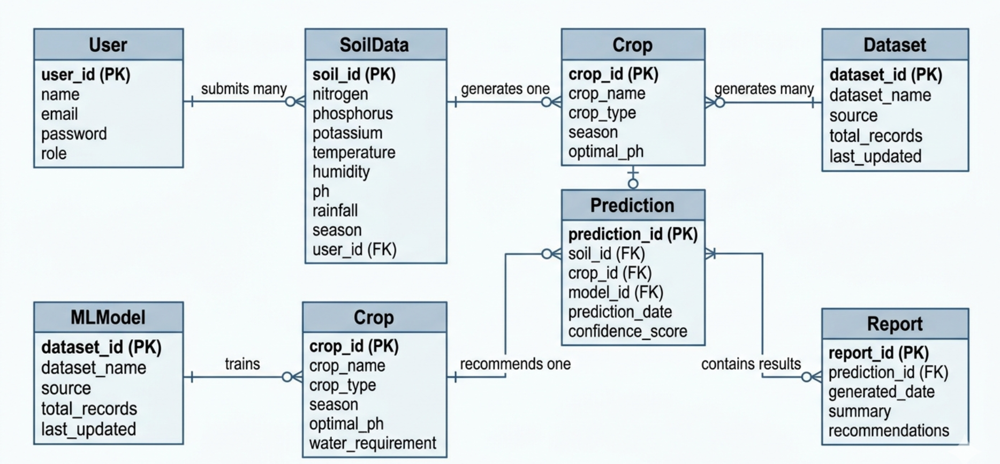

# OptiCrop-Smart-Agriculture-Production-Optimization-Engine

# Entity Relationship (ER) Diagram

The ER diagram represents the core entities involved in the **OptiCrop Smart Agricultural Production Optimization System** and illustrates how these entities interact with one another. It provides a structured approach for organizing user information, soil data, crop recommendations, machine learning models, prediction outcomes, and generated reports within the system database.

## Primary Entities

The ER diagram consists of seven primary entities:

1. User
2. SoilData
3. Crop
4. Dataset
5. MLModel
6. Prediction
7. Report

Each entity is uniquely identified using a primary key as follows:

* **User:** `user_id`
* **SoilData:** `soil_id`
* **Crop:** `crop_id`
* **Dataset:** `dataset_id`
* **MLModel:** `model_id`
* **Prediction:** `prediction_id`
* **Report:** `report_id`

## Relationships

The relationships between entities are defined as follows:

* **User to SoilData:** One user can submit multiple soil data records for crop analysis (**One-to-Many**).

* **SoilData to Prediction:** One soil data record generates a single crop prediction result (**One-to-One**).

* **Crop to Prediction:** One crop can be recommended across multiple prediction results (**One-to-Many**).

* **MLModel to Prediction:** One machine learning model can generate multiple prediction records (**One-to-Many**).

* **Dataset to MLModel:** One dataset can be used to train multiple machine learning models (**One-to-Many**).

* **Prediction to Report:** One prediction can generate multiple agricultural reports and recommendations (**One-to-Many**).

## Foreign Keys

The entities are linked through the following foreign keys:

* `SoilData` references `User` through `user_id`.
* `Prediction` references `SoilData` through `soil_id`.
* `Prediction` references `Crop` through `crop_id`.
* `Prediction` references `MLModel` through `model_id`.
* `Report` references `Prediction` through `prediction_id`.

## Cardinality

The cardinality of the relationships defines how entities interact within the system. A single user can submit multiple soil data records for agricultural analysis. Each soil data entry is processed by a machine learning model to generate crop prediction results. A crop may appear in multiple prediction outcomes, while one machine learning model can generate predictions for numerous users under different soil conditions. Additionally, each prediction may generate multiple reports containing farming summaries and recommendations.

## Normalization and Database Structure

The ER diagram follows normalization principles by separating user information, soil parameters, crop details, datasets, machine learning models, prediction records, and reports into independent entities. This design minimizes redundancy, improves scalability, enhances data integrity, and ensures efficient management of agricultural and prediction-related information.

## Use Case Coverage

The ER model supports the major functionalities of the **OptiCrop Smart Agricultural Production Optimization System**, including:

* Collecting and managing soil and environmental data from users.
* Predicting suitable crops using machine learning algorithms.
* Managing datasets and trained machine learning models.
* Generating intelligent crop recommendations and prediction reports.
* Supporting sustainable farming practices and data-driven agricultural decision-making.

# Pre-requisites

The project was developed using a set of powerful python-based tools and libraries for data processing, machine learning, visualization, and deployment. These technologies provide the foundation for efficient model development, analysis, and application deployment.

* Anaconda Navigator
* Pycharm
* Numpy
* Pandas
* Scikit-learn
* Matplotlib
* Seaborn
* Flask